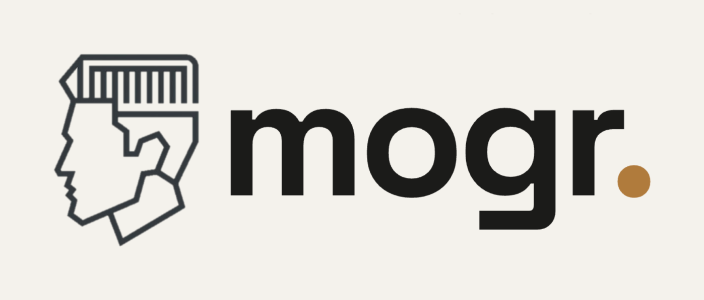
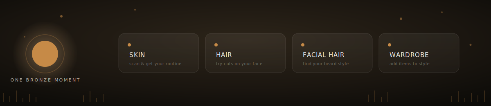
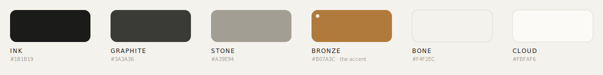

<picture>
  <source media="(prefers-color-scheme: dark)" srcset="./public/assets/mogr-logo-horizontal-dark.png">
  
</picture>

### men's grooming, systemized.

one selfie in, a whole profile out. skin, hair, facial hair, wardrobe, all reasoned
about by AI, all remembered, all yours.

<p>
  
  
  
  
  
  
  
</p>



---

## what it actually does

mogr is not a face-rating app. no scores, no percentiles, no shame. it's a
coach: scan once, get read honestly, act on a routine, come back and it
already knows you.

- **skin** — vision read on a selfie, backed by a 3-run self-consistency vote
  (three independent GPT reads, majority-voted per concern) so a single bad
  frame can't swing the diagnosis. turns into a routine, not a grade.
- **hair** & **facial hair** — reads face shape, type, density, growth, then
  proposes styles and renders a face-preserving *on-you* preview for each one.
- **wardrobe** — the deep end. photograph your closet, get it auto-tagged,
  ask for an outfit in plain English ("frat party, y2k" / "cafe but I've got
  a meeting"), get back real outfits built from what you own.
- **your colours** — a three-question quiz plus your scan data drives a
  deterministic seasonal-colour-theory engine. no LLM guesses your palette;
  the same inputs always produce the same six "works for you" swatches.
- **the console** — one profile, enriched by every scan. streaks, a routine
  tracker, and a "today's fit" pick that's stable all day and changes with
  the date, no server cron required.

## how it thinks

the interesting engineering is in **not** calling an LLM more than it has to.

```
you type "date night, smart casual" ──▶ ① intent interpreter (LLM)
                                              │  structured JSON: occasion,
                                              │  formality target, weather,
                                              │  aesthetic, constraints
                                              ▼
your whole closet ─────────────────────▶ ② candidate scorer (pure code, 0 AI)
                                              │  soft-scores every garment,
                                              │  caps + floors so no slot
                                              │  starves, no hard filters
                                              ▼
                                          ③ stylist (LLM)
                                              │  reasons ONLY over the ranked
                                              │  shortlist → up to 3 complete,
                                              │  non-repeating outfits
                                              ▼
                                          outfits, with rationale + fit notes
```

that middle stage is the trick: a full closet reasoned about outfit-by-outfit
is combinatorial and expensive. scoring it deterministically first, then
handing the model a small, ranked, best-first shortlist, keeps quality high
and cost bounded.

a few other deliberate choices:

- **capture happens before the API does.** the scan camera runs MediaPipe
  Face Mesh entirely client-side: pose (yaw/roll/pitch from landmark
  geometry), lighting/exposure, Laplacian-variance blur detection, gray-world
  white balance. a bad photo never leaves the browser, let alone gets billed.
- **identical requests don't re-think.** an order-insensitive cache-key hash
  compares a new request to whatever produced the last stored result (same
  scan, same questionnaire), so the model only gets called when something
  actually changed.
- **garments get tagged, not guessed at.** every closet photo goes through
  Photoroom's ghost-mannequin cutout, then GPT vision tags it against a
  16-field schema (colour + hex, formality score, weather fit, layering
  zone, clash colours...). the model is told to abstain rather than invent,
  because a bad tag poisons every future outfit that touches it.
- **colour is math, not vibes.** the palette engine is pure functions over
  undertone/depth/contrast. zero randomness, zero drift between visits.

## our colors

charcoal-and-bone, one bronze accent, used sparingly. dark mode is the default,
a designed theme rather than an inverted one — see [`DESIGN.md`](./DESIGN.md).



## stack

| layer | what's actually running |
|---|---|
| framework | Next.js 15 (App Router), React 19, TypeScript |
| styling | Tailwind v4, tokens in `globals.css`, dark mode as a designed theme (default) |
| data | Supabase Postgres, owner-only RLS on every table, Supabase Storage for photos |
| auth | Supabase email OTP |
| vision + reasoning | OpenAI vision + chat completions (JSON-mode), self-consistency voting on skin |
| image generation | OpenAI image-edit, face-preserving style/beard previews |
| garment cutouts | Photoroom Ghost Mannequin API (sandboxed automatically outside prod) |
| capture QA | MediaPipe Face Mesh, in-browser, pure math, no server round-trip |
| landing motion | GSAP + ScrollTrigger + Lenis |

## running it

```bash
npm install
cp .env.local.example .env.local   # fill in Supabase / OpenAI / Photoroom keys
npm run dev                         # http://localhost:3000
```

Supabase schema lives in `supabase/migrations/` — apply them in order against
your project. Ghost-mannequin calls are sandboxed (free, watermarked) unless
`NODE_ENV=production`, so local wardrobe testing never burns Photoroom credits.

```bash
npm run build && npm run start      # production
```

## map of the repo

```
src/
  app/
    (auth)/            login, email verification
    (app)/scan/         the capture flow (MediaPipe gate lives here)
    (console)/          dashboard, scans, routine, wardrobe, per-feature results
    api/                 skin · hair · facial-hair · wardrobe route handlers
  components/           feature UI, grouped by surface
  lib/
    openai.ts           server-only vision / chat / image-edit calls
    wardrobe/            interpreter → filter → stylist, palette, tagging, photoroom
    skin/ hair/ facial-hair/   per-feature content + prompts
    streak/              routine streak logic
supabase/migrations/    schema + RLS, one file per change
```

See [`DESIGN.md`](./DESIGN.md) for the visual system (ink / bronze / bone, the
"." brand device, type and motion rules) and [`PRODUCT.md`](./PRODUCT.md) for
the product principles this is all in service of: strengths first, never a
number, one bronze moment per view.

<br>

<sub>built with a lot of bronze<span style="color:#B07A3C">.</span></sub>
