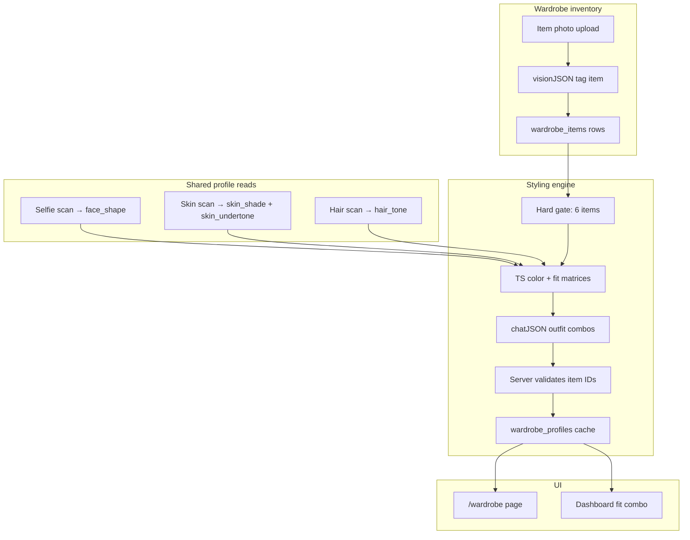
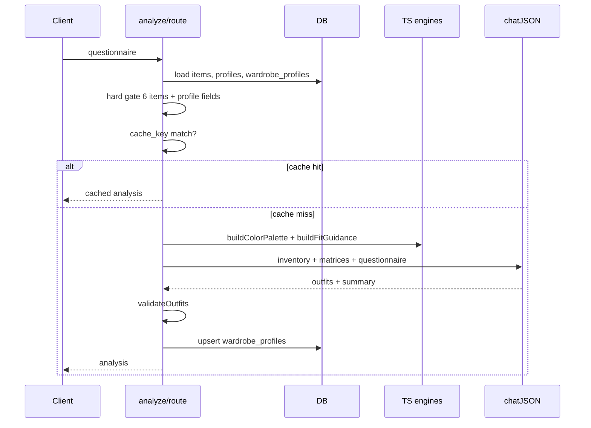

# Wardrobe Feature — Implementation Plan

## Current state

Three PRD workflows are **done** ([hair](src/app/(console)/hair/page.tsx), [facial-hair](src/app/(console)/facial-hair/page.tsx), [skin](src/app/(console)/skin/page.tsx)). Wardrobe has **only**:

- DB table [`wardrobe_items`](supabase/migrations/0001_profiles_and_features.sql) (unused; `image_url` column never wired)
- Dashboard/sidebar **placeholders** ([`data.ts`](src/lib/dashboard/data.ts), [`ConsoleSidebarNav.tsx`](src/components/dashboard/ConsoleSidebarNav.tsx), [`EditPreferences.tsx`](src/components/dashboard/EditPreferences.tsx))
- No `/wardrobe` route, no API, no `src/lib/wardrobe/`

Wardrobe is **text-only** (no `editImage` / previews per PRD §5.1 vs §5.4).

---

## Architecture overview



**Pattern to clone:** [skin analyze](src/app/api/skin/analyze/route.ts) (deterministic matrix + LLM personalization layer) + [hair haircare route](src/app/api/hair/haircare/route.ts) (cached `chatJSON` on profile row) + [hair page](src/app/(console)/hair/page.tsx) (mode state machine, pill questionnaire).

---

## Phase 0 — Profile prerequisites (small cross-feature writes)

PRD §5.4 requires **skin undertone + hair tone**. Today:

| Field | Column | Status |
|-------|--------|--------|
| `face_shape` | `profiles.face_shape` | Written by hair/facial-hair analyze |
| `skin_shade` | `profiles.skin_shade` | Written by skin analyze |
| `skin_undertone` | `profiles.skin_undertone` | **Column exists, never written** |
| `hair_tone` | *(missing)* | **Not captured** |

### 0a. Skin undertone (extend existing skin feature)

In [`src/lib/skin/content.ts`](src/lib/skin/content.ts):

- Add `skinUndertone: "Warm" | "Cool" | "Neutral"` to `SkinRead` schema + `SKIN_ANALYSIS_PROMPT`
- Merge in [`src/app/api/skin/analyze/route.ts`](src/app/api/skin/analyze/route.ts) `mergeReads()` (majority vote)
- Persist: `profiles.update({ skin_shade, skin_undertone })` alongside existing shade write

Cosmetic-only framing (same as `skinShade`) — never ethnicity/clinical labels.

### 0b. Hair tone (extend existing hair feature)

New migration [`supabase/migrations/0009_profiles_hair_tone.sql`](supabase/migrations/0009_profiles_hair_tone.sql):

```sql
alter table public.profiles add column if not exists hair_tone text;
```

In [`src/lib/hair/content.ts`](src/lib/hair/content.ts) + [`src/app/api/hair/analyze/route.ts`](src/app/api/hair/analyze/route.ts):

- Add `hair_tone` to vision JSON: one of `Black | DarkBrown | Brown | LightBrown | Blonde | Auburn | Gray | Red`
- Persist to `profiles.hair_tone` on analyze (same pattern as `face_shape`)

### 0c. Wardrobe analyze gate on profile

Before running styling, require:

- `profiles.skin_shade` **and** `profiles.skin_undertone` → prompt link to `/skin` if missing
- `profiles.hair_tone` → prompt link to `/hair` if missing
- `profiles.face_shape` → soft prompt to `/scan` + hair (used for fit matrix; analyze can proceed if missing with reduced fit specificity)

---

## Phase 1 — Database (migration `0010_wardrobe_profiles.sql`)

Do **not** edit `0001`. Add:

### `wardrobe_profiles` (one row per user — mirrors `hair_profiles` / `skin_profiles`)

```sql
create table public.wardrobe_profiles (
  user_id        uuid primary key references auth.users(id) on delete cascade,
  questionnaire  jsonb,
  summary        text,
  analysis       jsonb,   -- full WardrobeAnalysis output
  cache_key      text,    -- canonical snapshot for invalidation
  updated_at     timestamptz not null default now()
);
-- + RLS owner-only + updated_at trigger
```

### Extend `wardrobe_items`

| Change | Why |
|--------|-----|
| `storage_path text` (new) | Match [`scans.storage_path`](src/lib/scan/persist.ts) pattern; deprecate unused `image_url` |
| `updated_at timestamptz` | Inventory change detection for cache |
| Keep `category`, `name`, `color`, `data jsonb` | `data` holds vision tags: `primaryColor`, `secondaryColor`, `pattern`, `formality`, `fitHint`, `taggedAt` |

Storage layout: `{userId}/wardrobe/{itemId}.jpg` in `user-media` bucket (existing RLS covers it).

---

## Phase 2 — Namespace: `src/lib/wardrobe/`

### [`content.ts`](src/lib/wardrobe/content.ts) — single source of truth

**Enums (strict — all AI output must use these):**

- `WardrobeCategory`: `top | bottom | outerwear | footwear | accessory`
- `ColorFamily`: ~20 grooming-safe families (e.g. `Navy`, `Charcoal`, `Olive`, `Camel`, `White`, `Black`, `Indigo`, `Rust`, `Sage`, …) — no free-text hex from model
- `Pattern`: `solid | stripe | check | print | texture`
- `Formality`: `casual | smart_casual | formal`
- `FitType`: `slim | straight | relaxed | oversized` (PRD fit guidance)

**Questionnaire** (pill selectors, 4–5 questions):

| id | Purpose |
|----|---------|
| `styleVibe` | casual / smart-casual / minimal / street / classic |
| `fitPreference` | slim / regular / relaxed / mixed |
| `occasion` | everyday / work / going-out / mixed |
| `layering` | low / medium / high (outerwear usage) |

**Types:**

```ts
interface WardrobeItem { id, category, name, color, storagePath, data: ItemTags }
interface ColorPalette { flattering: ColorSwatch[]; neutrals: ColorSwatch[]; caution: ColorSwatch[]; summary: string }
interface OutfitCombo { id, name, itemIds: string[], rationale, occasion, formality }
interface FitGuidance { primary: FitType; rationale: string; tips: string[] }
interface WardrobeAnalysis { summary, palette, outfits: OutfitCombo[], fit, profileSnapshot }
```

**Deterministic engines (TypeScript — no LLM):**

1. **`buildColorPalette({ skinUndertone, skinShade, hairTone })`**
   - Lookup table keyed by `undertone × shade` → base flattering/neutral/caution color families
   - Hair-tone modifier (e.g. high contrast for dark hair + deep shade)
   - Returns fixed arrays; LLM only writes `summary` wording referencing these families

2. **`buildFitGuidance({ faceShape, fitPreference, styleVibe })`**
   - Face-shape rules (generic, no body measurement — PRD MVP):
     - Round → structured shoulders, vertical lines, avoid boxy oversized tops
     - Square → softer drape, slightly tapered bottoms
     - Oblong → horizontal breaks, layered mid-section
     - Heart → balance lower half, avoid heavy shoulder padding
     - etc. (mirror logic density in [`facial-hair/content.ts`](src/lib/facial-hair/content.ts) face-shape tables)
   - User `fitPreference` overrides primary fit bucket

3. **`validateOutfits(outfits, items, minCategories)`**
   - Every `itemId` must exist in inventory
   - Each outfit must include ≥1 `top` + ≥1 `bottom` (footwear/outerwear optional)
   - Reject duplicates / empty combos server-side before persisting

**Prompts:**

- `ITEM_TAG_PROMPT` — `visionJSON` on upload: category, `ColorFamily`, pattern, formality; **must abstain** (`category: "unknown"`) if not a wearable
- `WARDROBE_ANALYSIS_PROMPT` — `chatJSON`:
  - Input: inventory JSON (id, category, name, colors), precomputed palette + fit matrix, questionnaire, profile snapshot
  - **Hard rules:** exactly 3–5 outfits; every `itemIds` entry MUST be from provided inventory; no new items; no brands; no shopping links; strengths-first tone (PRD §4); reference specific owned item names in rationale
  - Outfit variety: not 5 versions of jeans + tee

**Copy:** `WARDROBE_COPY` for all UI strings (eyebrows, gate messages, empty states).

### [`upload.ts`](src/lib/wardrobe/upload.ts)

- Resize item photo (reuse [`resizeSelfie`](src/lib/scan/storage.ts) or lighter max dimension ~800px)
- Upload to `{userId}/wardrobe/{uuid}.jpg`
- Insert `wardrobe_items` row
- Return item id for tagging

### [`inventory.ts`](src/lib/wardrobe/inventory.ts)

- `countByCategory(items)` → gate logic
- `inventoryCacheKey(items, questionnaire, profile)` → wraps [`canonical()`](src/lib/cacheKey.ts)

**Hard gate (your choice):** analyze blocked until:

- ≥ **2 tops**, ≥ **2 bottoms**, ≥ **1 other** (outerwear, footwear, or accessory) = **6 items minimum**
- UI shows progress bar: "4/6 items — add 1 more bottom and 1 outerwear to unlock styling"

---

## Phase 3 — API routes

All routes: `runtime = "nodejs"`, auth via [`createClient`](src/lib/supabase/server.ts), owner RLS.

| Route | Method | Role |
|-------|--------|------|
| [`/api/wardrobe/items`](src/app/api/wardrobe/items/route.ts) | GET | List user items + signed thumbnail URLs |
| | POST | Create item (body: base64 or multipart) → upload → tag via `visionJSON` → update row |
| [`/api/wardrobe/items/[id]`](src/app/api/wardrobe/items/[id]/route.ts) | PATCH | Edit name/category/color (manual override) |
| | DELETE | Delete row + storage object |
| [`/api/wardrobe/analyze`](src/app/api/wardrobe/analyze/route.ts) | POST | Full styling run |

### Analyze route flow



- Cache invalidates when: any item add/delete/tag change, questionnaire change, or profile snapshot change (`skin_undertone`, `skin_shade`, `hair_tone`, `face_shape`)
- `maxDuration = 60` (text only)
- Model: reuse `OPENAI_VISION_MODEL` for tagging, default chat model for analyze (same as haircare)

---

## Phase 4 — UI

### [`src/app/(console)/wardrobe/page.tsx`](src/app/(console)/wardrobe/page.tsx)

**Mode state machine:**

| Mode | When |
|------|------|
| `loading` | Initial fetch |
| `need-profile` | Missing skin or hair profile reads |
| `inventory` | Building/editing wardrobe (default first visit) |
| `questionnaire` | User taps "Get my styling" (only if gate passed) |
| `analyzing` | API in flight |
| `results` | Cached or fresh analysis |

**Layout (match existing console pages):**

1. **Profile strip** — face shape, skin shade/undertone, hair tone (read-only chips from `profiles`)
2. **Inventory section** — grid of item cards (thumbnail, category badge, color swatch, edit/delete)
   - [`WardrobeItemGrid.tsx`](src/components/wardrobe/WardrobeItemGrid.tsx)
   - [`AddItemModal.tsx`](src/components/wardrobe/AddItemModal.tsx) — photo capture/upload via [`ImageUpload`](src/components/app/ImageUpload.tsx), optional manual category/color override after AI tag
   - Gate progress component: "6/6 items — ready to style"
3. **Questionnaire** — pill selectors from `WARDROBE_QUESTIONS`
4. **Results** — three sections per PRD:
   - **Color palette** — swatches from deterministic matrix + summary (`PaletteSection.tsx`)
   - **Outfits from your wardrobe** — 3–5 cards listing owned items by name with rationale; "Save outfit" → `saved_looks` (`kind: "wardrobe"`, `meta: { itemIds }`)
   - **Fit guidance** — primary fit + 2–3 tips (`FitSection.tsx`)

No regenerate-on-new-scan banner (wardrobe doesn't use selfie directly), but **"Re-analyze"** when inventory or questionnaire changes (compare `cache_key`).

### [`src/components/wardrobe/WardrobePreferences.tsx`](src/components/wardrobe/WardrobePreferences.tsx)

Replace `ComingSoon` in [`EditPreferences.tsx`](src/components/dashboard/EditPreferences.tsx) — persist default questionnaire answers to `wardrobe_profiles.questionnaire` (same pattern as hair tab).

---

## Phase 5 — Shared integration (coordinate touches)

| File | Change |
|------|--------|
| [`src/lib/supabase/middleware.ts`](src/lib/supabase/middleware.ts) | Add `"/wardrobe"` to `PROTECTED_PREFIXES` |
| [`ConsoleSidebarNav.tsx`](src/components/dashboard/ConsoleSidebarNav.tsx) | `wardrobe: "/wardrobe"` in `ITEM_ROUTES` |
| [`dashboard/page.tsx`](src/app/(console)/dashboard/page.tsx) | `CATEGORY_HREF.wardrobe = "/wardrobe"`; replace hard-coded `DASHBOARD.fit` with live read from `wardrobe_profiles.analysis.outfits[0]` (first outfit item names + palette note) |
| [`EditPreferences.tsx`](src/components/dashboard/EditPreferences.tsx) | Import `WardrobePreferences` for wardrobe tab |

---

## Anti-hallucination / non-generic advice strategy

This is the core quality bar. Layer constraints like skin/hair:

| Layer | Mechanism | Reference |
|-------|-----------|-----------|
| **Owned items only** | Prompt + server `validateOutfits()` rejects unknown IDs | PRD §5.4 MVP boundary |
| **Deterministic palette** | TS matrix from real profile fields; model cannot invent flattering colors outside enum list | [`SKIN_ROUTINE_PROMPT`](src/lib/skin/content.ts) Rule 1 |
| **Deterministic fit base** | TS matrix from `face_shape` + user preference | Facial-hair face-shape tables |
| **Strict JSON schema** | Fixed field names, enum values, outfit count 3–5 | All `*/content.ts` prompts |
| **Item tagging** | Vision assigns category/color from enums on upload — analyze references tagged data | Reduces "olive overshirt" when user owns navy |
| **Input fusion** | Prompt requires citing item `name` + `category` + `color` in each rationale | Hair "reference face shape/hair/wave" |
| **Caching** | `canonical()` on full input snapshot | [`cacheKey.ts`](src/lib/cacheKey.ts) |
| **Abstention** | Item tag returns `unknown` if not clothing; user must confirm | Skin `unclear` severity pattern |
| **Voice** | Strengths-first, no scores, no brands | PRD §4 + DESIGN.md §8 |

---

## Phase 6 — Optional polish (same PR, lower priority)

- **Dashboard coaching blurb** — append wardrobe CTA when `wardrobe_profiles` empty but inventory ≥4
- **Delete cascade** — when item deleted, invalidate analysis cache (clear `wardrobe_profiles.analysis` if referenced item removed)
- **Rate limiting** — follow PLAN.md production note; wardrobe analyze is cheaper than image gen but still unthrottled today

---

## File checklist (new files)

```
supabase/migrations/0009_profiles_hair_tone.sql
supabase/migrations/0010_wardrobe_profiles.sql
src/lib/wardrobe/content.ts
src/lib/wardrobe/upload.ts
src/lib/wardrobe/inventory.ts
src/app/api/wardrobe/items/route.ts
src/app/api/wardrobe/items/[id]/route.ts
src/app/api/wardrobe/analyze/route.ts
src/app/(console)/wardrobe/page.tsx
src/components/wardrobe/WardrobeItemGrid.tsx
src/components/wardrobe/AddItemModal.tsx
src/components/wardrobe/PaletteSection.tsx
src/components/wardrobe/OutfitSection.tsx
src/components/wardrobe/FitSection.tsx
src/components/wardrobe/WardrobePreferences.tsx
src/components/wardrobe/GateProgress.tsx
```

**Modified (small, coordinated):**

- `src/lib/skin/content.ts` + `src/app/api/skin/analyze/route.ts` (undertone)
- `src/lib/hair/content.ts` + `src/app/api/hair/analyze/route.ts` (hair_tone)
- `middleware.ts`, `dashboard/page.tsx`, `ConsoleSidebarNav.tsx`, `EditPreferences.tsx`

---

## Test plan

1. **Profile gate** — wardrobe analyze returns `need-skin-profile` / `need-hair-profile` with correct links
2. **Inventory gate** — blocked at 5 items; passes at 6 with category mix
3. **Item tag** — upload tee photo → category `top`, color from enum; non-clothing photo → `unknown`
4. **Outfit validation** — mock LLM response with fake item ID → route strips/rejects
5. **Cache** — same inventory + questionnaire → second analyze returns `cached: true`, no OpenAI call
6. **Cache bust** — add item → cache miss, new outfits only reference new inventory
7. **Dashboard** — fit combo shows first outfit from real analysis, not placeholder
8. **Preferences** — saved questionnaire pre-fills on wardrobe page

---

## Implementation order

Build in this sequence to avoid blocked work:

1. Migrations + profile field writes (skin undertone, hair tone)
2. `lib/wardrobe/content.ts` (types, matrices, prompts) — can unit-test matrices in isolation
3. Item CRUD API + upload/tag
4. Analyze API + validation
5. Wardrobe page (inventory first, then questionnaire + results)
6. Dashboard/sidebar/preferences wiring
7. Manual QA with a real 6+ item wardrobe
